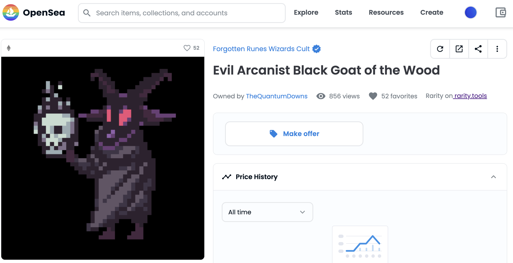

# rarity-dappmod
Rarity Tools via Tampermonkey Script

## Requisites

Install Tampermonkey [Chrome](https://chrome.google.com/webstore/detail/tampermonkey/dhdgffkkebhmkfjojejmpbldmpobfkfo) or [Firefox](https://addons.mozilla.org/it/firefox/addon/tampermonkey/)

## Install

Install [Rarity-Dappmod](https://github.com/emilianobonassi/rarity-dappmod/raw/main/rarity-dappmod.user.js)

## Features
- show rarity tools direct link on OpenSea item page (only on Forgotten Runes Wizards Cult collection as example)

## Examples

